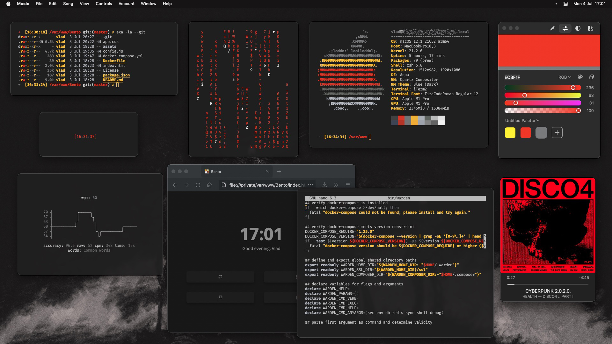

### 🚀 Finder

- `Preferences -> General -> Show Hard Disks`
- `Preferences -> Advanced -> Show all filename extensions`

### ⚙️ System

- `Keyboard -> Key Repeat / Delay Until Repeat` to max
- `Keyboard -> Text` disable Correct spelling..., Capitalise..., Add full stop...
- Disable disc warning (must restart Mac to take effect): `sudo defaults write /Library/Preferences/SystemConfiguration/com.apple.DiskArbitration.diskarbitrationd.plist DADisableEjectNotification -bool YES && sudo pkill diskarbitrationd`
- Re-enable disc warning: `sudo defaults delete /Library/Preferences/SystemConfiguration/com.apple.DiskArbitration.diskarbitrationd.plist DADisableEjectNotification && sudo pkill diskarbitrationd`
- Ejectify alternative: https://ejectify.app

### 🌍 WEB

- Firefox `brew install --cask firefox`
  - Google Chrome Dark theme
  - Custom New Tab Page 
    - [My StartPage](https://wintermute-84.github.io/bento/)
  - AdGuard
  - XDebug Helper
  - ClearURLs
  - Decentraleyes

### 🎨️ Utils
- [DaVinci Resolve](https://www.blackmagicdesign.com/products/davinciresolve/)
- [CotEditor](https://github.com/coteditor/CotEditor)
- [ColorSlurp](https://colorslurp.com/)
- [Folx](https://mac.eltima.com/folx-download.html) `brew install --cask folx`
- [CakeBrew](https://github.com/brunophilipe/Cakebrew)
- [Unarchiver](https://apps.apple.com/us/app/the-unarchiver/id425424353?mt=12)
- [iTerm2](https://iterm2.com/) 
  - https://github.com/wintermute-84/iterm-conf
- [CopyClip](https://apps.apple.com/us/app/copyclip-clipboard-history/id595191960?mt=12)
- [Magnet](https://apps.apple.com/us/app/magnet/id441258766?mt=12)
- [ImgOptim](https://imageoptim.com/mac)
- [IINA](https://iina.io/) `brew install --cask iina`

### 📡 Coms

- [Slack](https://slack.com/downloads/mac)
- [WhatsApp](https://www.whatsapp.com/download/)
- [Telegram](https://macos.telegram.org/)

### 👺 Dev
- [PHPStorm](https://www.jetbrains.com/phpstorm/download/#section=mac)
- [php](php.net) 
  - `brew tap shivammathur/php`
  - `brew install shivammathur/php/php@8.0`
  - `echo 'export PATH="/opt/homebrew/opt/php@8.0/bin:$PATH"' >> ~/.zshrc`
- [Python](#) `brew install pyenv`, `pyenv install 3.10.5`
- [iTerm2](https://iterm2.com/)
- [TablePlus](https://tableplus.com/)
- [Postman](https://www.postman.com/)
- [VSCodium](https://github.com/VSCodium/vscodium)
- [Docker Desktop](https://www.docker.com/products/docker-desktop/)
  - [warden multi-arch](https://github.com/drpayyne/warden-multi-arch)
  - [warden](https://github.com/davidalger/warden)
  - [docker-compose](#) `brew install docker-compose`
- [Spark](https://sparkmailapp.com/)
- [UTM](https://getutm.app/install/)
- [Linear](https://linear.app/download)

### 🍺 Unix Utils

- [brew](https://brew.sh/) `/bin/bash -c "$(curl -fsSL https://raw.githubusercontent.com/Homebrew/install/HEAD/install.sh)"`
- [wget](#) `brew install wget`
- [neofetch](https://github.com/dylanaraps/neofetch) `brew install neofetch`
- [wifi-password](https://github.com/rauchg/wifi-password)  `brew install wifi-password`
- [exa](https://github.com/ogham/exa) - `ls` replacement `brew install exa`
- [imgcat](https://github.com/eddieantonio/imgcat) - `brew install eddieantonio/eddieantonio/imgcat`
- [NeoVim](https://neovim.io/) `brew install neovim`
- [Oh-My-Zsh](https://github.com/ohmyzsh/ohmyzsh)
  - `brew install zsh zsh-completions`
  - `sh -c "$(curl -fsSL https://raw.github.com/robbyrussell/oh-my-zsh/master/tools/install.sh)"`
  - `chsh -s /bin/zsh`
- [cmatrix](https://github.com/abishekvashok/cmatrix/) `brew install cmatrix`
- [typioca](https://github.com/bloznelis/typioca) `brew install bloznelis/tap/typioca`
- [Terminal Clock](https://github.com/wintermute-84/clock)
- [TTY-Clock](https://www.carta.tech/man-pages/man1/tty-clock.1.html) `brew install tty-clock`
- [htop](https://github.com/htop-dev/htop) `brew install htop` (gtop / btop)

